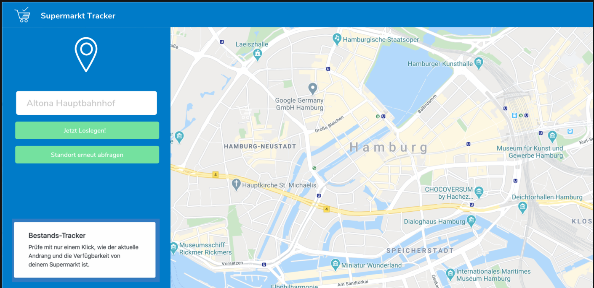
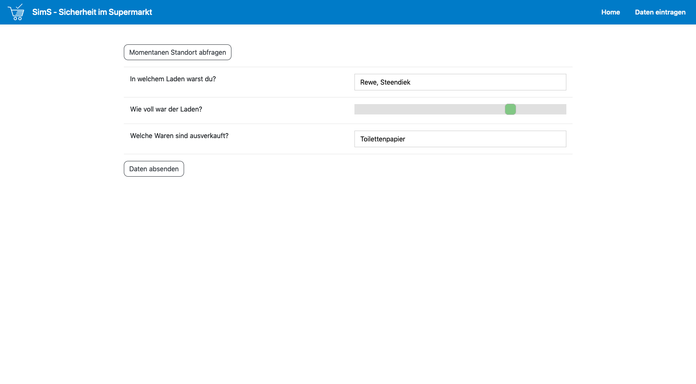

# virus-vs-toilettenpapier

Product board: https://miro.com/app/board/o9J_kuyoEDM=/

* Users can submit their GPS coordinates, the name of the store they're at, how crowded it was and what goods were missing
* Other users can then get an aggregate view of this data, what stores are in the neighbourhood, how full they are and what they are out of

---

## Problembeschreibung
1. Zu viele Kunden welche zu ähnlichen Zeiten die Supermärkte besuchen und so in überfüllten Märkten sich ggf. einen hohen Infektionsrisiko aussetzen
2. Der einzelne Kunde hat aktuell nur begrenzte Information darüber, welche Supermärkte gerade gering, bzw. hoch ausgelastet sind
3. Es gibt keinen Überblick, darüber welche Produkte des täglichen Bedarfs in einem Supermarkt gerade ausverkauft oder vorrätig sind, so dass ein Kunde sich ggf. unnötig auf den Weg macht.

Wer kennt es nicht, es ist Pandemie und alle gehen hin. Insbesondere scheinen viele Menschen erhöhtes Interesse an Supermärkten und dem dort  angebotenen “flauschigen Gold” zu haben. Es gilt zu verhindern, dass zu vielen Menschen gleichzeitig in engen und überfüllten Supermärkten auflaufen, oder aber bei möglicherweise eintretenden Einlassbegrenzungen der Märkte, vor diesen warten müssen und sich so einer möglichen Ansteckung aussetzen, bzw. Den Erreger weitergeben. 

Um eine möglichst gleich-verteilte Auslastung der Märkte zu unterstützen, können Supermarkt-Kunden mit Hilfe unserer App angeben, wie gut besucht ein Supermarkt zum Zeitpunkt des Besuches war. Die hierbei generierten, anonymisierten Daten werden dann auf einer Karte der Umgebung, inkl aller Supermärkte visualisiert, so das man sich vor dem Einkauf jederzeit einen Überblick über die Auslastung der Märkte in der Umgebung verschaffen kann. 

Für die Erhebung der Auslastung, ist dabei nicht nur die Position der Nutzer relevant, sondern ebenso ihre subjektive Einschätzung zur Auslastung. Dies ermöglicht auch bei relativ wenigen Nutzern, welche Daten bereitstellen, eine schon näherungsweise sinnvolle Bewertung der Auslastung. 

## Komponenten des Lösungsansatzes.
### REST-Schnittstelle 
Es wurde eine REST Schnittstelle bereitgestellt, welche von der ebenfalls entwickelten Web-Applikation, als auch perspektivisch von anderen Applikationen genutzt werden kann um die folgenden Informationen zu senden, bzw. zu ermitteln:

* Rückgabe der Supermärkte in der Nähe auf Basis eines Standortes
* Rückhabe der aktuellen Auslastung eines bestimmten Supermarktes
* Eingabe wie ausgelastet ein Supermarkt war, auf Basis vordefinierter Werte

Diese ermöglicht es, über eine Anfrage, die Supermärkte in der Nähe zurückzugeben. Aus der Liste der ermittelten Märkte kann der Nutzer in der Applikation dann einen gerade besuchten Markt auswählen und sich anzeigen lassen, wie frequentiert dieser aktuell ist. Ebenfalls ist es für den Nutzer möglich 

### Webapp
Das Anzeigen und Eintragen der benötigen Daten wird über die SimS-Sicherheit Im Supermarkt App ermöglicht, welche sich im Browser nahezu aller Endgeräte anzeigen lässt. Über die Auswahl des Standortes, lässt sich schnell ein Supermarkt auswählen und die benötigen Infos ermitteln, bzw. anderen Nutzern bereitstellen

Die Lösung basiert ausschließlich auf öffentlich verfügbaren Daten und Tools. Die Daten zu Supermärkten wurden mit Hilfe von Open Street Map ermittelt. Für die Entwicklung der Daten-Schnittstelle wurde die Programmiersprache Rust verwendet.  Die Datenhaltung geschieht über die Open Source Datenbank PostGis. Die Web-Applikation wurde mit Hilfe von Svelte entwickelt.
